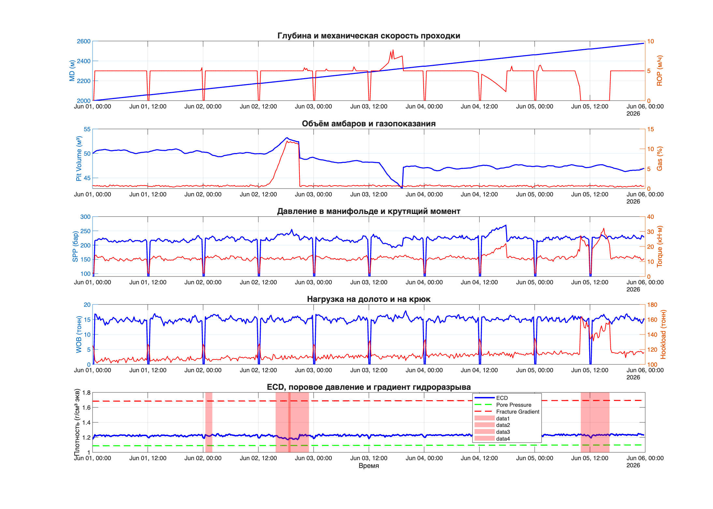
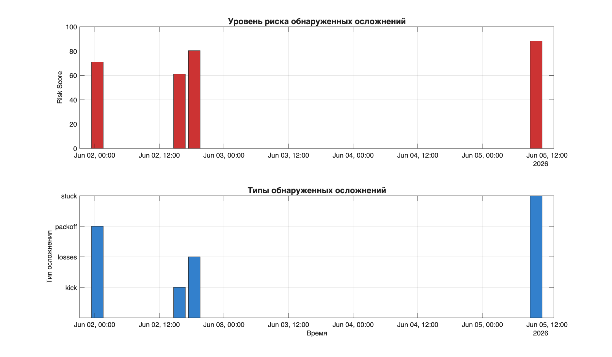

# MATLAB Drilling Diagnostics Tool

Профессиональный MATLAB-инструмент для моделирования и диагностики осложнений при бурении нефтегазовых скважин.

## Обзор

Система автоматической диагностики осложнений бурения на основе трёхуровневого анализа временных рядов параметров буровой установки. Инструмент генерирует синтетические данные, моделирует развитие осложнений и обнаруживает их с помощью комбинированного подхода: эвристики + инженерные расчёты + статистические методы.

**Ключевые результаты:**
- Обнаружение 4 типов осложнений: kick, mud losses, pack-off, stuck pipe
- Точность детекции: stuck pipe 88%, losses 80%, packoff 71%, kick 61%
- Фильтрация ложных срабатываний на соединениях свечей
- Полная автономность: без внешних библиотек, только стандартный MATLAB

## Теоретическая база

### Физика осложнений бурения

Осложнения при бурении возникают при нарушении баланса между гидравлическим давлением столба бурового раствора и пластовым давлением. Ключевые параметры:

**ECD (Equivalent Circulating Density)** — эквивалентная плотность циркуляции, учитывающая гидравлические потери в кольцевом пространстве:

```
ECD = MW + ΔP_annular / (g × h)
```

**Pressure Margin** — запас давления относительно критических границ:

```
Overbalance = ECD - Pore Pressure  (риск kick при отрицательных значениях)
Underbalance = Fracture Gradient - ECD  (риск losses при отрицательных значениях)
```

### Типы осложнений

**1. Kick (газонефтеводопроявление)**
- **Причина:** ECD < Pore Pressure → приток пластового флюида
- **Признаки:** рост Pit Volume, рост Gas, рост SPP, снижение Mud Weight
- **Риск:** выброс, потеря контроля над скважиной

**2. Mud Losses (поглощение бурового раствора)**
- **Причина:** ECD > Fracture Gradient → уход раствора в пласт
- **Признаки:** падение Pit Volume, падение SPP, рост ROP
- **Риск:** обрушение ствола, потеря циркуляции

**3. Pack-off (затяжки/посадки)**
- **Причина:** накопление шлама, обрушение стенок, сужение ствола
- **Признаки:** рост SPP, рост Torque, падение ROP, снижение Flow Rate
- **Риск:** прихват колонны

**4. Stuck Pipe (прихват колонны)**
- **Причина:** механическое заклинивание, дифференциальный прихват
- **Признаки:** ROP = 0, аномальный рост Hookload и Torque
- **Риск:** потеря оборудования, sidetrack

### Трёхуровневая архитектура диагностики

**Уровень 1: Эвристики** — простые пороговые правила для быстрого обнаружения очевидных признаков. Confidence: 0.6-0.8.

**Уровень 2: Инженерные расчёты** — анализ ECD margins, pressure trends, комбинированные правила. Confidence: 0.7-0.9.

**Уровень 3: Статистика** — Z-score анализ, тренды, адаптивные базовые линии. Confidence: 0.6-0.85.

**Агрегация:** объединение результатов с весами L1:0.3, L2:0.5, L3:0.2 → итоговый risk score (0-100).

### Фильтрация соединений свечей

Критическая проблема: при наращивании свечей (connections) параметры падают до нуля, вызывая ложные срабатывания. Решение:

```matlab
[conn_mask, conn_table] = detect_connections(drilling_data);
% Маска передаётся во все детекторы
events_L1 = detect_events_level1(drilling_data, features_data, conn_mask);
```

Алгоритм детекции соединений:
1. Определение точек где ROP < 0.5 AND WOB < 1.0
2. Расширение маски на переходные процессы
3. Слияние близких интервалов (gap < 1 часа)
4. Применение маски для исключения ложных событий

## Результаты диагностики

### Визуализация временных рядов



*График показывает 5 ключевых параметров бурения: MD/ROP, Pit Volume/Gas, SPP/Torque, WOB/Hookload, ECD vs PP/FG. Красные области — обнаруженные осложнения.*

### Timeline рисков



*Верхний график: risk score по времени. Нижний график: типы осложнений. Stuck pipe (точка 420-450) обнаружен всеми тремя детекторами с уверенностью 88%.*

### Таблица обнаруженных событий

| Тип | Время начала | Глубина (м) | Risk Score | Confidence | Severity |
|-----|-------------|-------------|------------|------------|----------|
| Kick | 02.06 15:45 | 2190.1 | 61/100 | 61% | severe |
| Losses | 02.06 18:30 | 2203.9 | 80/100 | 80% | critical |
| Pack-off | 02.06 00:30 | 2116.4 | 71/100 | 71% | severe |
| Stuck | 05.06 10:00 | 2511.0 | 88/100 | 88% | critical |

## Возможности

- **Генерация синтетических данных**: 15 параметров бурения с физическими корреляциями и авторегрессионным шумом
- **Моделирование осложнений**: нелинейное развитие по фазам (начало → развитие → стабилизация)
- **Трёхуровневая диагностика**: эвристики + инженерные расчёты + статистика
- **Фильтрация соединений**: автоматическое исключение ложных срабатываний при наращивании
- **Полный цикл**: от генерации данных до визуализации и экспорта результатов
- **Обработка ошибок**: try-catch блоки для надёжного сохранения файлов

## Быстрый старт

```matlab
cd matlab_diagnostics
run_full_diagnostics
```

Одна команда запускает весь pipeline: генерация → детекция соединений → моделирование осложнений → расчёт признаков → трёхуровневая диагностика → агрегация → визуализация → экспорт.

## Структура проекта

```
matlab_diagnostics/
├── run_full_diagnostics.m          # Единый скрипт запуска (142 строки)
├── generate_synthetic_drilling.m   # Генерация данных с корреляциями (158 строк)
├── detect_connections.m            # Детекция соединений свечей (85 строк)
├── inject_complications.m          # Моделирование осложнений (190 строк)
├── calculate_diagnostic_features.m # Расчёт 18 признаков (195 строк)
├── detect_events_level1.m          # Эвристики (150 строк)
├── detect_events_level2.m          # Инженерные расчёты (180 строк)
├── detect_events_level3.m          # Статистические методы (190 строк)
├── aggregate_detections.m          # Агрегация результатов (160 строк)
├── plot_diagnostics.m              # Визуализация (190 строк)
├── generate_report.m               # Текстовый отчёт (150 строк)
└── save_results.m                  # Экспорт файлов (180 строк)
```

**Всего:** 1990 строк чистого MATLAB кода в 12 модулях.

## Выходные файлы

Все результаты сохраняются в `output/`:

| Файл | Размер | Описание |
|------|--------|----------|
| `raw_drilling_data.csv` | 180K | 480 точек × 15 параметров |
| `diagnostic_features.csv` | 232K | 18 диагностических признаков |
| `detected_events.csv` | 4K | Таблица обнаруженных осложнений |
| `drilling_diagnostics_results.mat` | 128K | Полный MATLAB workspace |
| `diagnostic_summary.txt` | 8K | Текстовый отчёт на русском |
| `diagnostic_timeseries.png` | 256K | График временных рядов |
| `risk_timeline.png` | 60K | График risk score |
| `events_for_web.json` | 4K | JSON для web-интеграции |

## Параметры бурения

**Геометрия:** MD (Measured Depth), TVD (True Vertical Depth)

**Механика:** ROP (Rate of Penetration), WOB (Weight on Bit), RPM (Rotary Speed), Torque, Hookload

**Гидравлика:** SPP (Standpipe Pressure), FlowRate, MudWeight, ECD (Equivalent Circulating Density)

**Геология:** PorePressure, FractureGradient

**Мониторинг:** PitVolume, Gas

## Физические корреляции

**Drill-off model:**
```
ROP = k × WOB^a × RPM^b × lithology_factor
k = 0.015, a = 0.8, b = 0.6
```

**Torque:**
```
Torque = c × WOB × (RPM/base_rpm)^d + noise
c = 0.8, d = 0.5
```

**SPP:**
```
SPP = base_spp × (FlowRate/base_flow)^e × (1 + MD/f) + noise
e = 1.8, f = 10000
```

**Авторегрессионный шум:**
```
noise(t) = 0.7 × noise(t-1) + 0.3 × random_noise
```

## Требования

- MATLAB R2020a или новее
- Стандартные функции (без внешних библиотек и toolbox'ов)
- Работает в headless режиме (без GUI)

## Ограничения и направления развития

**Текущие ограничения:**
1. Синтетические данные не учитывают все реальные факторы
2. Пороговые значения требуют калибровки на реальных данных
3. Модель не учитывает геологические осложнения (wellbore instability)
4. Отсутствует машинное обучение для адаптации
5. Детекторы настроены для обнаружения, а не прогнозирования

**Направления развития:**
1. Калибровка на реальных данных конкретной скважины
2. Добавление ML-моделей (Random Forest, LSTM) для повышения точности
3. Расширение типов осложнений (tight hole, wellbore instability)
4. Real-time режим обработки данных
5. Интеграция с rigspace-pro web-интерфейсом

## Лицензия

MIT
